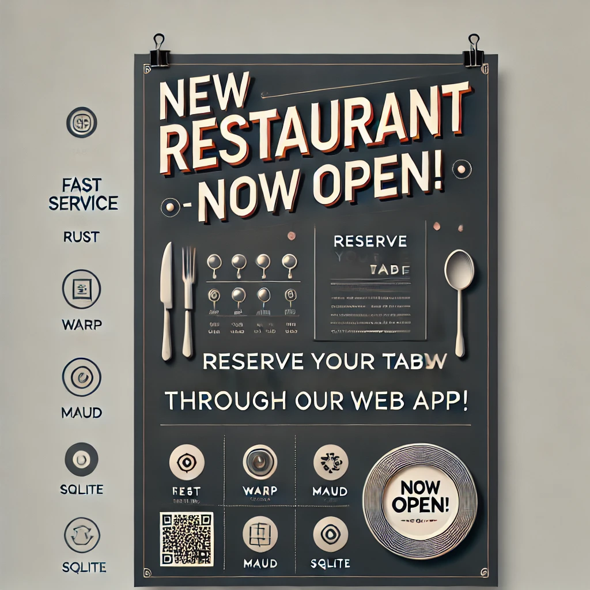

# ruserwation

Restaurant reservation web app using Rust, Warp, Maud, and SQLite.

## Objective

Currently, I'm a Spring Boot developer, but I miss the days when I built monolithic websites using LAMP (Linux, Apache, MySQL, PHP). Starting from scratch - installing Linux (though I preferred FreeBSD), setting up Apache, configuring MySQL, and finally running PHP - felt rewarding. When I saw `phpinfo()` display, it was a moment of triumph!

Nowadays, frameworks like Spring provide abstracted data access layers, such as Spring JPA and Spring JDBC, where I don't need to worry about direct connections. Back then, it was all raw - you had to write SQL directly and handle connections manually.

My goal with this project is to build something from scratch, with minimal reliance on frameworks, using Rust for both the front and back end. While it might be more efficient to use React for the frontend (and I know how to build React UIs), I want to fully immerse myself in Rust. Unlike Spring's `@RestController`, with Warp, I need to write my own routes from scratch. It takes more time, but it's fun!

This project allows me to do things my way, in my own style, without needing PR approvals or restrictions. I can choose my testing frameworks and enjoy the autonomy!

I can't guarantee a bug-free product, but I'll do my best to make it production-ready. That's my goal, and I hope I can stay consistent in achieving it.

In Rust, I trust!

## Project Status

| Module      | Status                         |
| ----------- | ------------------------------ |
| Admin       | Backlog :waxing_crescent_moon: |
| Customer    | Backlog :new_moon:             |
| Database    | Pending :first_quarter_moon:   |
| Reservation | Backlog :new_moon:             |
| Restaurant  | Backlog :new_moon:             |

## Deployment to AWS EC2 - Ubuntu

```shell
# Connect to AWS EC2
chmod 600 ${AWS_KEY_FILE}

alias aws-ssh='ssh -i ${AWS_KEY_FILE} ${AWS_EC2_USER}@${AWS_EC2_UBUNTU}'
```

```shell
# Upgrade
sudo apt update
sudo apt list --upgradable
sudo apt upgrade
sudo apt install build-essential

# Install Rust
curl --proto '=https' --tlsv1.2 -sSf https://sh.rustup.rs | sh
source ${HOME}/.cargo/en

# Build
sudo mkdir -p /app
cd /app
git clone https://github.com/rkfcheung/ruserwation.git
cd ruserwation
cargo build --release

# Install Nginx (Optional)
sudo apt install nginx
sudo usermod -aG www-data ${AWS_EC2_USER}
sudo chown -R www-data:www-data /app/ruserwation/static

sudo vi /etc/nginx/sites-available/default
```

```text
	server_name ruserwation.com www.ruserwation.com;

	location / {
		proxy_pass http://localhost:3030;
		proxy_set_header Host $host;
		proxy_set_header X-Real-IP $remote_addr;
		proxy_set_header X-Forwarded-For $proxy_add_x_forwarded_for;

		try_files $uri $uri/ =404;
	}

	location /static/ {
		alias /app/ruserwation/static/;

		try_files $uri $uri/ =404;
	}
```

```shell
# Install Certbox (Optional)
sudo apt install certbot python3-certbot-nginx
sudo ufw allow 'Nginx Full'
sudo certbot --nginx
```

### Running the App

```shell
# Local
cd ruserwation

scp -i ${AWS_KEY_FILE} .env.prod ${AWS_EC2_USER}@${AWS_EC2_UBUNTU}:/app/ruserwation
scp -i ${AWS_KEY_FILE} static/*_prod.* ${AWS_EC2_USER}@${AWS_EC2_UBUNTU}:/app/ruserwation/static
scp -i ${AWS_KEY_FILE} static/images/*_prod.* ${AWS_EC2_USER}@${AWS_EC2_UBUNTU}:/app/ruserwation/static/images
```

```shell
# AWS EC2
export APP_ENV=prod

/app/ruserwation/target/release/ruserwation
```



## Useful Nginx Commands

```shell
# Check Nginx status
systemctl status nginx.service

# Restart Nginx service
sudo systemctl restart nginx

# Check Nginx access log
sudo tail -f /var/log/nginx/access.log

# Check Nginx error log
sudo tail -f /var/log/nginx/error.log
```
